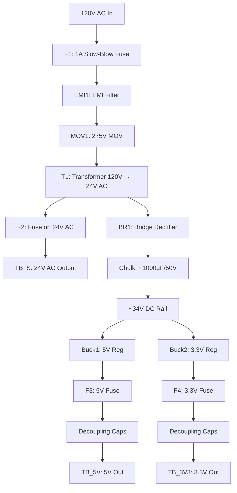
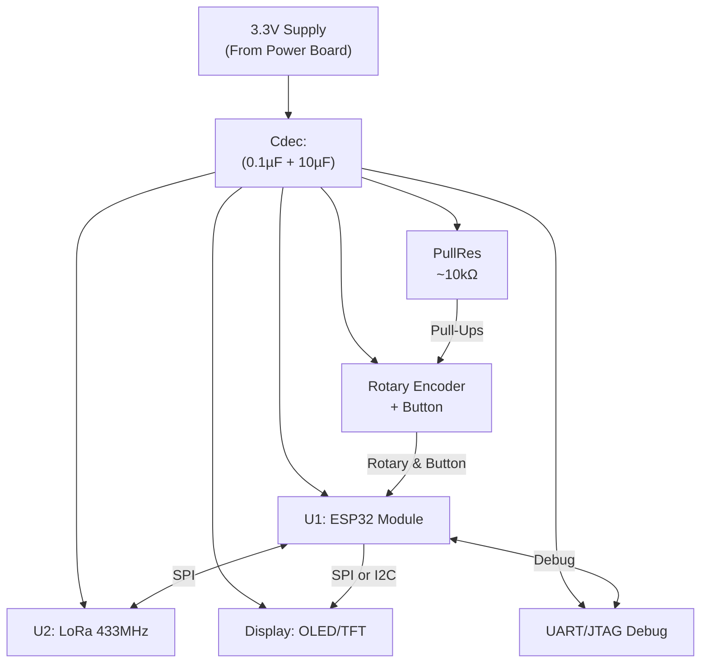
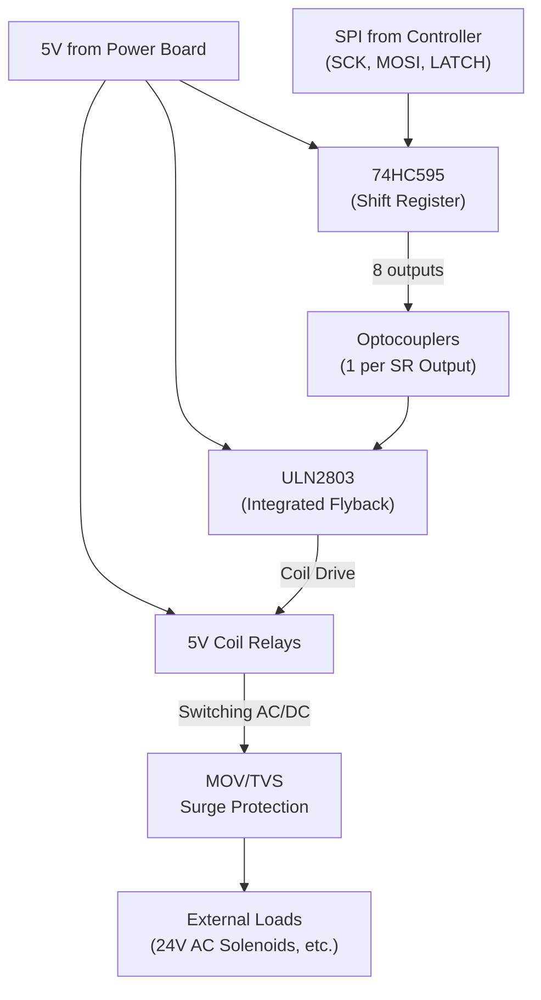

# Lucuma Farm Radio

## Table of Contents

1. [Introduction](#introduction)  
2. [System Architecture](#system-architecture)  
3. [Boards](#boards)  
   - [Power](#power)  
   - [Controller with Integrated UI](#controller-with-integrated-ui)  
   - [Relay (Effector)](#relay-effector)  
4. [System-Wide Usage and Setup](#system-wide-usage-and-setup)  
5. [Next Steps / More Features / Roadmap](#next-steps--more-features--roadmap)

---

## Introduction

Lucuma Farm Radio is a modular hardware and firmware platform designed to **automate greenhouse and farm operations** (e.g., irrigation valves, ventilation). Core features:

- **ESP32** for Wi-Fi, Bluetooth, and local control  
- **LoRa (~433 MHz)** for long-range wireless communication  
- **24 V AC solenoid valves** supported for irrigation  
- **Wired or wireless sensors** (I²C/SPI or LoRa)  
- **Integrated user interface** (display + rotary encoder)

---

## System Architecture

The system has **three primary boards** plus optional field devices (valves, fans, pumps). Each board is designed for **ease of installation, serviceability, and scalability**.

6. **Power**  
   - Accepts 120 V AC  
   - Provides 24 V AC for solenoids and regulated 5 V/3.3 V DC rails  
   - Includes surge/EMI protection and multiple fuses  

7. **Controller with Integrated UI**  
   - ESP32-based for main control  
   - LoRa (~433 MHz) module onboard  
   - Includes a display, rotary encoder, push button  
   - Exposes SPI/I²C buses for sensors and relay control  

8. **Relay (Effector)**  
   - Uses 5 V mechanical relays to switch loads (24 V AC or low-voltage DC)  
   - Driven by shift registers and transistor arrays  
   - MOV/TVS surge protection on relay outputs  

---

## Boards

### Power

**Functions & Features**  
- **Input:** 120 V AC with fused and EMI-filtered entry  
- **Transformer:** Steps down to 24 V AC for solenoids (with optional secondary fuse)  
- **Regulators:** Converts ~34 V DC to **5 V** and **3.3 V** with separate fuses on each rail  
- **Protection:** Varistor (MOV) for line surge, proper creepage/clearance, and a bulk capacitor to smooth DC

**BOM**

| Ref   | Description                                          | Qty | Example / Notes                     |
| ----- | ---------------------------------------------------- | --- | ----------------------------------- |
| F1    | Fuse, 1 A Slow-Blow (120 V AC input)                 | 1   | Littelfuse 215 Series               |
| EMI1  | EMI Filter Module (Inductor + Capacitor)             | 1   | Schaffner FN series                 |
| MOV1  | Metal Oxide Varistor (~275 V)                        | 1   | e.g., Vishay S14K275                |
| T1    | Transformer 120 V AC → 24 V AC, ≥1 A                 | 1   | Triad, Hammond, etc.                |
| F2    | Fuse, 1 A (optional on 24 V AC line)                 | 1   | Protects solenoid supply            |
| BR1   | Bridge Rectifier, ≥1 A, ≥50 V                        | 1   | KBP* or GBU* package                |
| Cbulk | Bulk Capacitor, e.g., 1000 µF / 50 V                 | 1   | Smooths ~34 V DC                    |
| Buck1 | DC-DC (32–34 V → 5 V), ≥1 A                          | 1   | LM2596 module or similar            |
| Buck2 | DC-DC (32–34 V → 3.3 V), ≥1 A                        | 1   | LM2596-3.3 or similar               |
| **F3** | Fuse (e.g., 500 mA) on 5 V rail                      | 1   | Protects 5 V DC                     |
| **F4** | Fuse (e.g., 500 mA) on 3.3 V rail                    | 1   | Protects 3.3 V DC                   |
| DecCaps | Decoupling Caps (0.1 µF + 10 µF near each regulator) | 2   | Ensure rail stability               |
| TB_5V | Terminal block for 5 V output                        | 1   | Powers Relay Board                  |
| TB_3V3 | Terminal block for 3.3 V output                     | 1   | Powers Controller/peripherals       |
| TB_24AC | Terminal block for 24 V AC output                  | 1   | For solenoid valves                 |

### Controller with Integrated UI

**Functions & Features**  
- **ESP32 Module (ESP32-WROOM)** for Wi-Fi, Bluetooth, local control  
- **LoRa (~433 MHz)** module for long-range radio  
- **Display** (OLED/TFT) + **Rotary Encoder** with push button for user interface  
- **UART/JTAG header** for debugging  
- **I²C/SPI expansion** for sensors, communication to Relay board

**BOM**

| Ref      | Description                                  | Qty | Example / Notes                       |
| -------- | -------------------------------------------- | --- | ------------------------------------- |
| U1       | ESP32 Module (e.g., ESP32-WROOM-32)          | 1   | Main microcontroller                  |
| U2       | LoRa Module (~433 MHz, SX1278)               | 1   | Long-range comms                      |
| Display  | OLED/TFT module (SPI or I²C)                 | 1   | e.g., SSD1306 or ST7735               |
| Encoder  | Rotary Encoder + button (KY-040 style)       | 1   | Menu navigation/input                 |
| Cdec     | 0.1 µF + 10 µF decoupling near display/ESP32 | 1+  | Minimizes noise                       |
| PullRes  | Pull-up resistors (~10 kΩ) for encoder lines | 2   | Stable encoder signals                |
| HDR      | UART/JTAG header (optional)                  | 1   | For debugging (TX/RX/3.3 V/GND)       |

### Relay (Effector)

**Functions & Features**  
- **Shifts the Controller’s SPI signals** (via 74HC595) into multiple outputs  
- **ULN2803** driver with integrated flyback diodes for **5 V mechanical relays**  
- **MOV/TVS** across relay contacts for surge suppression  
- **Optocouplers** for isolation between shift register outputs and ULN2803 (as shown in diagram)

**BOM**

| Ref       | Description                                           | Qty  | Example / Notes                           |
| --------- | ----------------------------------------------------- | ---- | ----------------------------------------- |
| ShiftExp  | 74HC595 (SPI shift register)                          | 1    | For 8 outputs (expand as needed)          |
| Opto      | Optocouplers (1 per shift-expander output)            | 8    | e.g., PC817 or similar                    |
| ULN2803   | Transistor driver array (with flyback diodes)         | 1    | Drives 8 × 5 V relay coils               |
| Relays    | 5 V coil mechanical relays (ratings per load)         | 8    | e.g., Songle SRD-05V, 24 V AC contact OK  |
| MOV/TVS   | Surge protection (one across each relay contact pair) | 8    | e.g., ~60 V rating for 24 V solenoid loads|
| R-Array   | Resistor array (~220–1 kΩ) for optional drive shaping | 1    | May be integrated with optocouplers       |
| TermLoad  | Terminal blocks for external loads                    | -    | E.g., for solenoid/pump connections       |
| LEDx (opt)| Relay status LEDs (+ series resistor)                 | -    | e.g., 1 kΩ resistor in series             |

---

## System-Wide Usage and Setup

9. **Assembly**  
   - Place boards in a suitably rated enclosure (e.g., IP65 or similar) if outdoors.  
   - Keep high-voltage wiring (120 V AC) away from low-voltage circuits (3.3 V, 5 V).  
   - Use correct creepage/clearance and grounding practices.

10. **Power-Up**  
   - Install appropriate slow-blow/time-delay fuses (F1, F2, F3, F4).  
   - Measure 5 V and 3.3 V rails prior to installing the controller and relay boards.  
   - Connect solenoid valves (24 V AC) only after confirming proper power and fuse protection.

11. **Firmware**  
   - Program the **ESP32** with Arduino IDE, PlatformIO, or ESP-IDF.  
   - Initialize LoRa (~433 MHz) libraries and configure SPI/I²C pins.  
   - Ensure the shift register outputs match the pin mapping for the relay drivers.

12. **Surge and ESD Protection**  
   - MOV/TVS across relay contacts for inductive loads.  
   - Add ESD diodes if lines are exposed to harsh conditions.  
   - Keep wiring runs short or twisted/shielded for best noise immunity.

## Next Steps / More Features / Roadmap

- **Data Logging:** Add an SD card for local event/storage logs.  
- **Sensor Expansion:** Integrate soil moisture, temperature, humidity sensors, etc.  
- **Connectivity Protocols:** MQTT, Modbus, or other farm-management system integrations.  
- **Outdoor Hardening:** Additional isolation, weather-proof enclosures, conformal coating, and robust cable glands.

---

**All schematics, BOM items, and text above are now consistent** with the final design decisions:  
- **Mechanical 5 V relays** (no SSR)  
- **MOV/TVS** for surge protection  
- **Separate fuses (F3, F4) on 5 V/3.3 V rails**  
- **Optocouplers** included for relay-board isolation  
